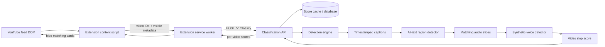

# SlopShield plugin

SlopShield is a Manifest V3 Chrome extension that hides likely AI-slop videos from regular YouTube feeds. This repository contains the extension and a local mock classification server, so plugin development can continue before the real detection engine is ready.

## What the mock server means

The extension and the future API agree on one request/response shape today. The mock returns random-looking scores instead of running models. Scores are deterministic per YouTube video ID, so the same card does not flicker between allowed and blocked while YouTube re-renders its feed.

When the engine is ready, replace the mock endpoint with the real API while preserving [`docs/API_CONTRACT.md`](docs/API_CONTRACT.md). The extension should not need an architectural rewrite.

## Architecture



The extension owns only the left side: DOM discovery, settings, API calls, and hiding cards. Caption retrieval, media access, inference, ranking, caching, and database work belong to the backend/engine team.

> Caption caveat: the official YouTube Data API does not provide downloadable captions for arbitrary public videos. `captions.list` does not contain the transcript, and `captions.download` requires permission to edit the video. The engine prototype from the earlier research used the unofficial `youtube-transcript-api`; the backend team must deliberately choose and validate its production caption source.

## Run the prototype

Requirements: Chrome and Node.js 20 or newer.

1. Start the mock server:

   ```bash
   npm run mock
   ```

2. Open `chrome://extensions`.
3. Enable **Developer mode**.
4. Click **Load unpacked** and choose this repository folder.
5. **Refresh every YouTube tab that was already open.** Chrome does not retroactively inject a newly loaded or reloaded content script into an existing page.
6. Open a regular YouTube Home, Search, Subscriptions, or Watch page.
7. Open the SlopShield popup to turn filtering on/off or change strictness.

`Preview mock scores` is enabled by default. Every scanned thumbnail receives a visible `MOCK …% · ALLOW/FLAG` badge. Turn preview off when you want flagged cards to be hidden.

The prototype intentionally ignores YouTube Shorts and `/shorts/` pages.

## What the extension extracts

The extension does **not** crawl all of YouTube. It observes the normal video cards that YouTube has rendered in the current tab. On Home, Search, Subscriptions, and related-video lists it extracts only:

- YouTube video ID
- canonical watch URL
- visible title
- visible channel name

It batches up to 50 new cards at a time. A `MutationObserver` discovers additional cards as YouTube navigates or infinite-scrolls. The extension does not extract transcripts, audio, cookies, watch history, or account data. The future backend receives the video IDs and performs caption retrieval and model inference.

## If nothing appears on YouTube

1. Confirm `npm run mock` is still running.
2. Open [http://localhost:8787/](http://localhost:8787/); it should return `"status":"ok"`.
3. Open `chrome://extensions` and click the reload icon on SlopShield.
4. Refresh the YouTube page after reloading the extension.
5. Keep `Preview mock scores` enabled. Every scanned thumbnail should show an `ALLOW` or `FLAG` badge.

The popup reports whether the mock API is online and how many videos are currently flagged. Turning preview off changes from visible score labels to actual hiding.

## Verify

```bash
npm test
curl http://localhost:8787/health
curl -X POST http://localhost:8787/v1/classify \
  -H 'Content-Type: application/json' \
  -d '{"threshold":0.7,"videos":[{"videoId":"demo-1"},{"videoId":"demo-2"}]}'
```

The mock server uses port **8787**, not 8087. Opening [http://localhost:8787/](http://localhost:8787/) shows its status and available endpoints. The classifier endpoint is a `POST` endpoint, so it is not meant to be opened directly as a normal browser page.

## Handoff to the real API

Before demo day, the backend teammate only needs to:

1. Implement the classification contract.
2. Deploy it behind HTTPS.
3. Replace `apiBaseUrl` in `src/background.js`.
4. Replace the localhost entry in `manifest.json` `host_permissions` with the deployed API origin.

Do not put YouTube API keys, model credentials, or engine code in the extension. Everything shipped in a Chrome extension is inspectable by users.

## Questions for the API and engine team

Please confirm these points before the extension switches from the mock server to the real detection service:

1. Is [`docs/API_CONTRACT.md`](docs/API_CONTRACT.md) the final request and response format?
2. What is the deployed HTTPS API URL and maximum batch size?
3. Are classification results returned immediately, or can the API return `pending` and require polling?
4. Is `slopScore` always a number from 0 to 1, and exactly what does that score represent?
5. How should the API represent missing transcripts, private or deleted videos, timeouts, and engine failures?
6. Which service caches results by `videoId`, and how long should cached scores remain valid?
7. What authentication and rate-limiting approach will be used? No secret API key can be shipped inside the extension.
8. Can the team provide several known allow/block video IDs for end-to-end integration tests?
9. Which model or pipeline version should be returned with a result so cached scores can be invalidated safely after engine changes?
10. Who owns transcript retrieval, audio slicing, retry behavior, and monitoring when the engine is unavailable?
